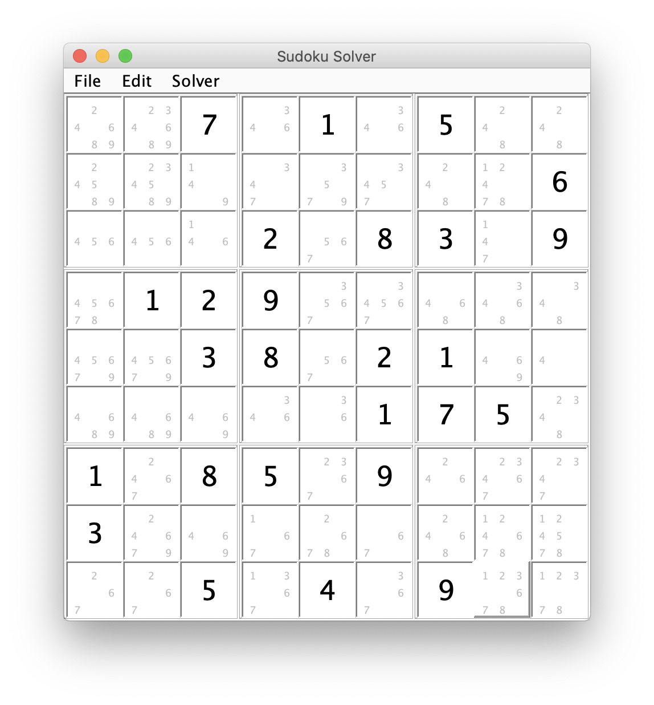

# Spencer's Sudoku

Solving Sudoku puzzles requires a combination of obvious pattern matching and more sophisticated logical induction. I find solving puzzles on paper frustratingly slow as I search methodically for well-established patterns. On the other hand, writing a backtracking algorithm to solve sudoku in mere milliseconds is easy enough for an introductory programming course.

This software represents an attempt at a middle ground: you can choose what patterns to automate and which to leave to the human.

## Compilation

The software can be built with maven:

    mvn package

The executable jar file will be produced in the `target` directory.

## Running

Requires java 8 or later.

    java -jar sudoku-0.1.0-SNAPSHOT.jar

## Changelog

- **2020-03-26**. Clean up, mavenize, and release code.
- **2010-11-15**. Better interface, most AI patterns
- **2005-08-31**. Initial code using dropdown menus